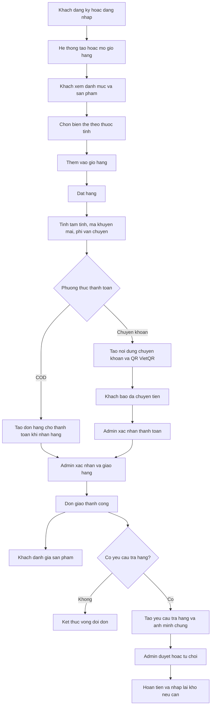

# Phân tích database website bán hàng

Tài liệu này chỉ tập trung vào các bảng nghiệp vụ đang vận hành website bán hàng. Các bảng Laravel tạo sẵn hoặc bảng hạ tầng như `users`, `password_reset_tokens`, `sessions`, `cache`, `cache_locks`, `jobs`, `job_batches`, `failed_jobs`, `personal_access_tokens` không được đưa vào phần chính vì không mô tả dữ liệu bán hàng. Riêng `personal_access_tokens` có thể được Sanctum dùng để lưu token đăng nhập API, nhưng không phải bảng nghiệp vụ.

## 1. Nhóm tài khoản khách hàng và quản trị

### `khach_hang`

Lưu tài khoản người dùng. Hệ thống dùng bảng này cho cả khách hàng và admin.

| Cột | Vai trò |
| --- | --- |
| `ma_kh` | Khóa chính |
| `ten_kh` | Tên khách hàng |
| `email` | Email đăng nhập, duy nhất |
| `mat_khau` | Mật khẩu đã mã hóa |
| `dien_thoai` | Số điện thoại, duy nhất, có thể rỗng |
| `vai_tro` | `false` là khách hàng, `true` là admin |
| `trang_thai` | `true` hoạt động, `false` bị khóa |
| `ngay_tao` | Ngày tạo tài khoản |
| `remember_token` | Token ghi nhớ đăng nhập |

Quan hệ chính:

- Một khách hàng có một `gio_hang`.
- Một khách hàng có nhiều `don_hang`.
- Một khách hàng có nhiều `danh_gia`.
- Một khách hàng có thể yêu thích nhiều `san_pham` qua `danh_sach_yeu_thich`.
- Admin cũng là bản ghi trong `khach_hang`, được nhận diện bằng `vai_tro = true`.

## 2. Nhóm danh mục, sản phẩm, biến thể

### `danh_muc`

Lưu danh mục sản phẩm.

| Cột | Vai trò |
| --- | --- |
| `ma_dm` | Khóa chính |
| `ten_dm` | Tên danh mục, duy nhất |
| `trang_thai` | Bật hoặc tắt danh mục |

Quan hệ: một danh mục có nhiều `san_pham`.

### `san_pham`

Lưu thông tin sản phẩm ở mức chung, chưa tách size, màu hoặc lựa chọn cụ thể.

| Cột | Vai trò |
| --- | --- |
| `ma_sp` | Khóa chính |
| `ma_dm` | Khóa ngoại tới `danh_muc.ma_dm` |
| `ten_sp` | Tên sản phẩm |
| `mo_ta` | Mô tả sản phẩm |
| `gia_co_ban` | Giá cơ bản |
| `trang_thai` | `active`, `inactive`, `out_of_stock` |
| `ngay_tao` | Ngày tạo sản phẩm |

Quan hệ:

- Thuộc một `danh_muc`.
- Có nhiều `bien_the_san_pham`.
- Có nhiều `hinh_anh_san_pham`.
- Có nhiều `danh_gia`.
- Có nhiều khách hàng yêu thích qua `danh_sach_yeu_thich`.

### `hinh_anh_san_pham`

Lưu ảnh sản phẩm.

| Cột | Vai trò |
| --- | --- |
| `ma_anh` | Khóa chính |
| `ma_sp` | Khóa ngoại tới `san_pham.ma_sp` |
| `url` | Đường dẫn ảnh |
| `anh_chinh` | Đánh dấu ảnh đại diện |

Quan hệ: một sản phẩm có nhiều ảnh, trong đó có thể có một ảnh chính.

### `thuoc_tinh`

Lưu loại thuộc tính của biến thể, ví dụ màu sắc hoặc kích cỡ.

| Cột | Vai trò |
| --- | --- |
| `ma_tt` | Khóa chính |
| `ten_tt` | Tên thuộc tính, duy nhất |

Quan hệ: một thuộc tính có nhiều `gia_tri_thuoc_tinh`.

### `gia_tri_thuoc_tinh`

Lưu giá trị cụ thể của thuộc tính, ví dụ đỏ, xanh, M, L.

| Cột | Vai trò |
| --- | --- |
| `ma_gt` | Khóa chính |
| `ma_tt` | Khóa ngoại tới `thuoc_tinh.ma_tt` |
| `gia_tri` | Giá trị thuộc tính |

Ràng buộc: cặp `ma_tt` và `gia_tri` là duy nhất.

### `bien_the_san_pham`

Lưu từng SKU bán được của sản phẩm. Đây là bảng quan trọng để tính tồn kho, giá bán, giỏ hàng và đơn hàng.

| Cột | Vai trò |
| --- | --- |
| `ma_bt` | Khóa chính |
| `ma_sp` | Khóa ngoại tới `san_pham.ma_sp` |
| `sku` | Mã SKU, duy nhất |
| `variant_signature` | Chữ ký tổ hợp thuộc tính, chống tạo trùng biến thể |
| `gia_ban` | Giá bán của biến thể |
| `so_luong_ton` | Số lượng tồn kho hiện tại |
| `nguong_canh_bao_ton` | Ngưỡng cảnh báo tồn thấp |
| `trang_thai` | Bật hoặc tắt biến thể |

Quan hệ:

- Thuộc một `san_pham`.
- Có nhiều giá trị thuộc tính qua `lien_ket_bien_the_gia_tri`.
- Xuất hiện trong giỏ hàng, đơn hàng, phiếu nhập kho, lịch sử kho và trả hàng.

### `lien_ket_bien_the_gia_tri`

Bảng trung gian nối biến thể với các giá trị thuộc tính.

| Cột | Vai trò |
| --- | --- |
| `ma_bt` | Khóa ngoại tới `bien_the_san_pham.ma_bt` |
| `ma_gt` | Khóa ngoại tới `gia_tri_thuoc_tinh.ma_gt` |

Khóa chính: tổ hợp `ma_bt`, `ma_gt`.

Ví dụ: biến thể SKU `AO001-RED-M` có thể nối tới giá trị `Màu = Đỏ` và `Size = M`.

## 3. Nhóm giỏ hàng và yêu thích

### `gio_hang`

Lưu giỏ hàng của khách hàng.

| Cột | Vai trò |
| --- | --- |
| `ma_gio_hang` | Khóa chính |
| `ma_kh` | Khóa ngoại tới `khach_hang.ma_kh`, duy nhất |

Quan hệ: một khách hàng có đúng một giỏ hàng.

### `chi_tiet_gio_hang`

Lưu từng biến thể trong giỏ hàng.

| Cột | Vai trò |
| --- | --- |
| `ma_gio_hang` | Khóa ngoại tới `gio_hang.ma_gio_hang` |
| `ma_bien_the` | Khóa ngoại tới `bien_the_san_pham.ma_bt` |
| `so_luong` | Số lượng khách muốn mua |

Khóa chính: tổ hợp `ma_gio_hang`, `ma_bien_the`.

### `danh_sach_yeu_thich`

Lưu sản phẩm khách hàng đã yêu thích.

| Cột | Vai trò |
| --- | --- |
| `ma_kh` | Khóa ngoại tới `khach_hang.ma_kh` |
| `ma_sp` | Khóa ngoại tới `san_pham.ma_sp` |

Khóa chính: tổ hợp `ma_kh`, `ma_sp`.

## 4. Nhóm đơn hàng, thanh toán, vận chuyển, khuyến mãi

### `don_hang`

Lưu thông tin đơn hàng, trạng thái xử lý, địa chỉ giao, phí vận chuyển và thanh toán.

| Cột | Vai trò |
| --- | --- |
| `ma_dh` | Khóa chính |
| `ma_kh` | Khóa ngoại tới `khach_hang.ma_kh` |
| `ngay_dat` | Thời điểm đặt hàng |
| `tam_tinh` | Tổng tiền hàng trước phí và giảm giá |
| `phi_van_chuyen` | Phí vận chuyển |
| `loai_khu_vuc_giao` | Loại khu vực giao hàng cũ |
| `shipping_zone` | Vùng giao hàng hiện dùng: nội thành, ngoại thành, tỉnh khác |
| `ma_km` | Khóa ngoại tới `ma_khuyen_mai.ma_km`, có thể rỗng |
| `ma_khuyen_mai` | Mã coupon dạng text đã áp dụng |
| `so_tien_giam` | Số tiền được giảm |
| `tong_tien` | Tổng tiền cuối cùng |
| `phuong_thuc_tt` | Phương thức thanh toán, ví dụ `cod`, `banking` |
| `trang_thai_thanh_toan` | Trạng thái thanh toán, ví dụ `unpaid`, `paid` |
| `noi_dung_chuyen_khoan` | Nội dung chuyển khoản |
| `qr_code_url` | Link QR VietQR |
| `khach_bao_da_chuyen_at` | Thời điểm khách báo đã chuyển khoản |
| `thanh_toan_xac_nhan_at` | Thời điểm admin xác nhận thanh toán |
| `thanh_toan_xac_nhan_boi` | Mã admin xác nhận, tham chiếu logic tới `khach_hang.ma_kh` |
| `dia_chi_giao` | Địa chỉ giao tổng hợp |
| `province_type` | Loại tỉnh/thành khách chọn, ví dụ HCM, Hà Nội, khác |
| `ma_tinh_thanh` | Mã tỉnh/thành |
| `ma_quan_huyen` | Mã quận/huyện |
| `ma_phuong_xa` | Mã phường/xã |
| `tinh_thanh` | Tên tỉnh/thành |
| `quan_huyen` | Tên quận/huyện |
| `phuong_xa` | Tên phường/xã |
| `dia_chi_chi_tiet` | Số nhà, đường, thông tin chi tiết |
| `trang_thai` | `pending`, `confirmed`, `shipping`, `delivered`, `cancelled` |
| `ghi_chu` | Ghi chú đơn hàng |

Quan hệ:

- Thuộc một `khach_hang`.
- Có nhiều `chi_tiet_don_hang`.
- Có thể áp dụng một `ma_khuyen_mai`.
- Có thể có nhiều `yeu_cau_tra_hang`.
- Có thể được khách đánh giá theo sản phẩm qua `danh_gia.ma_dh`.

### `chi_tiet_don_hang`

Lưu từng dòng sản phẩm trong đơn.

| Cột | Vai trò |
| --- | --- |
| `ma_dh` | Khóa ngoại tới `don_hang.ma_dh` |
| `ma_bien_the` | Khóa ngoại tới `bien_the_san_pham.ma_bt` |
| `so_luong` | Số lượng mua |
| `don_gia` | Giá tại thời điểm mua |

Khóa chính: tổ hợp `ma_dh`, `ma_bien_the`.

### `ma_khuyen_mai`

Lưu coupon và điều kiện áp dụng.

| Cột | Vai trò |
| --- | --- |
| `ma_km` | Khóa chính |
| `code` | Mã coupon, duy nhất |
| `loai_giam` | Loại giảm, ví dụ phần trăm hoặc số tiền cố định |
| `gia_tri` | Giá trị giảm |
| `don_toi_thieu` | Giá trị đơn tối thiểu |
| `giam_toi_da` | Giới hạn giảm tối đa |
| `bat_dau` | Ngày bắt đầu |
| `ket_thuc` | Ngày kết thúc |
| `gioi_han_su_dung` | Tổng số lượt dùng tối đa |
| `da_su_dung` | Số lượt đã dùng |
| `trang_thai` | Bật hoặc tắt mã |

### `lich_su_khuyen_mai`

Lưu việc khách hàng đã dùng mã khuyến mãi cho đơn nào.

| Cột | Vai trò |
| --- | --- |
| `ma_km` | Khóa ngoại tới `ma_khuyen_mai.ma_km` |
| `ma_kh` | Khóa ngoại tới `khach_hang.ma_kh` |
| `ma_dh` | Khóa ngoại tới `don_hang.ma_dh`, duy nhất |
| `so_tien_giam` | Số tiền đã giảm |
| `ngay_su_dung` | Thời điểm dùng mã |

Khóa chính: tổ hợp `ma_km`, `ma_kh`. Bảng này giúp chặn một khách dùng lại cùng một mã.

### `cau_hinh_thanh_toan_van_chuyen`

Lưu cấu hình phí vận chuyển và tài khoản ngân hàng nhận chuyển khoản.

| Cột | Vai trò |
| --- | --- |
| `id` | Khóa chính tự tăng |
| `phi_noi_thanh` | Phí nội thành |
| `phi_ngoai_thanh` | Phí ngoại thành |
| `phi_tinh_khac` | Phí tỉnh khác |
| `mien_phi_ship_bat` | Có bật miễn phí ship hay không |
| `nguong_mien_phi_ship` | Ngưỡng đơn hàng được miễn phí ship |
| `tinh_thanh_shop` | Tỉnh/thành của shop |
| `ma_tinh_thanh_shop` | Mã tỉnh/thành của shop |
| `quan_huyen_noi_thanh` | Danh sách quận/huyện nội thành dạng JSON |
| `ma_quan_huyen_noi_thanh` | Danh sách mã quận/huyện nội thành dạng JSON |
| `ma_ngan_hang` | Mã ngân hàng dùng tạo VietQR |
| `ten_ngan_hang` | Tên ngân hàng |
| `so_tai_khoan` | Số tài khoản nhận tiền |
| `ten_chu_tai_khoan` | Chủ tài khoản |
| `mau_noi_dung_chuyen_khoan` | Mẫu nội dung chuyển khoản |
| `created_at`, `updated_at` | Thời điểm tạo và cập nhật |

Bảng này thường chỉ có một bản ghi cấu hình hiện hành.

## 5. Nhóm đánh giá sản phẩm

### `danh_gia`

Lưu đánh giá của khách hàng cho sản phẩm, có thể gắn với đơn hàng đã mua.

| Cột | Vai trò |
| --- | --- |
| `ma_danh_gia` | Khóa chính |
| `ma_kh` | Khóa ngoại tới `khach_hang.ma_kh` |
| `ma_sp` | Khóa ngoại tới `san_pham.ma_sp` |
| `ma_dh` | Khóa ngoại tới `don_hang.ma_dh`, có thể rỗng |
| `so_sao` | Điểm đánh giá từ 1 đến 5 |
| `noi_dung` | Nội dung đánh giá |
| `trang_thai` | Trạng thái duyệt, ví dụ `pending`, `approved` |
| `phan_hoi_admin` | Phản hồi của admin |
| `ngay_phan_hoi` | Thời điểm admin phản hồi |
| `ngay_danh_gia` | Thời điểm khách đánh giá |

Ràng buộc: một đơn hàng chỉ đánh giá một sản phẩm một lần qua cặp `ma_dh`, `ma_sp`.

### `hinh_anh_danh_gia`

Lưu ảnh đính kèm đánh giá.

| Cột | Vai trò |
| --- | --- |
| `ma_anh_dg` | Khóa chính |
| `ma_danh_gia` | Khóa ngoại tới `danh_gia.ma_danh_gia` |
| `url_anh` | Đường dẫn ảnh |
| `ngay_tao` | Thời điểm tạo |

## 6. Nhóm trả hàng, hoàn tiền

### `yeu_cau_tra_hang`

Lưu yêu cầu trả hàng của khách.

| Cột | Vai trò |
| --- | --- |
| `ma_yeu_cau` | Khóa chính |
| `ma_dh` | Khóa ngoại tới `don_hang.ma_dh` |
| `ma_kh` | Khóa ngoại tới `khach_hang.ma_kh` |
| `ly_do` | Lý do trả hàng tổng quát |
| `mo_ta` | Mô tả thêm của khách |
| `trang_thai` | Trạng thái xử lý |
| `ghi_chu_admin` | Ghi chú nội bộ hoặc phản hồi xử lý |
| `ly_do_tu_choi` | Lý do từ chối nếu bị từ chối |
| `trang_thai_hoan_tien` | Trạng thái hoàn tiền |
| `da_nhap_kho` | Đã nhập lại kho hay chưa |
| `ngay_yeu_cau` | Thời điểm tạo yêu cầu |
| `ngay_cap_nhat` | Thời điểm cập nhật |

Quan hệ: một yêu cầu thuộc một đơn hàng và có nhiều dòng trả hàng.

### `chi_tiet_tra_hang`

Lưu từng biến thể trong yêu cầu trả hàng.

| Cột | Vai trò |
| --- | --- |
| `ma_yeu_cau` | Khóa ngoại tới `yeu_cau_tra_hang.ma_yeu_cau` |
| `ma_bien_the` | Khóa ngoại tới `bien_the_san_pham.ma_bt` |
| `ma_sp` | Khóa ngoại tới `san_pham.ma_sp` |
| `so_luong` | Số lượng trả |
| `ly_do` | Lý do trả riêng cho dòng hàng |
| `mo_ta` | Mô tả thêm |
| `ghi_chu` | Ghi chú |

Khóa chính: tổ hợp `ma_yeu_cau`, `ma_bien_the`.

### `hinh_anh_tra_hang`

Lưu ảnh bằng chứng cho yêu cầu trả hàng.

| Cột | Vai trò |
| --- | --- |
| `ma_anh_th` | Khóa chính |
| `ma_yeu_cau` | Khóa ngoại tới `yeu_cau_tra_hang.ma_yeu_cau` |
| `ma_bien_the` | Khóa ngoại tới `bien_the_san_pham.ma_bt`, có thể rỗng |
| `url_anh` | Đường dẫn ảnh |
| `ngay_tao` | Thời điểm tạo |

## 7. Nhóm quản lý kho

### `phieu_nhap_kho`

Lưu phiếu nhập kho.

| Cột | Vai trò |
| --- | --- |
| `ma_pnk` | Khóa chính |
| `ma_phieu` | Mã phiếu nhập, duy nhất |
| `ngay_nhap` | Ngày nhập kho |
| `ma_nguoi_nhap` | Khóa ngoại tới `khach_hang.ma_kh`, thường là admin |
| `ghi_chu` | Ghi chú |
| `ngay_tao` | Thời điểm tạo |

### `chi_tiet_phieu_nhap_kho`

Lưu từng biến thể được nhập trong phiếu nhập kho.

| Cột | Vai trò |
| --- | --- |
| `ma_pnk` | Khóa ngoại tới `phieu_nhap_kho.ma_pnk` |
| `ma_bien_the` | Khóa ngoại tới `bien_the_san_pham.ma_bt` |
| `so_luong` | Số lượng nhập |
| `ghi_chu` | Ghi chú |

Khóa chính: tổ hợp `ma_pnk`, `ma_bien_the`.

### `lich_su_bien_dong_kho`

Lưu nhật ký tăng giảm tồn kho.

| Cột | Vai trò |
| --- | --- |
| `ma_ls_kho` | Khóa chính |
| `ma_bien_the` | Khóa ngoại tới `bien_the_san_pham.ma_bt` |
| `loai_bien_dong` | Loại biến động, ví dụ nhập kho, bán hàng, điều chỉnh, trả hàng |
| `so_luong_thay_doi` | Số lượng thay đổi, dương hoặc âm |
| `ton_kho_truoc` | Tồn trước khi thay đổi |
| `ton_kho_sau` | Tồn sau khi thay đổi |
| `ma_nguoi_thuc_hien` | Khóa ngoại tới `khach_hang.ma_kh`, có thể rỗng |
| `thoi_gian` | Thời điểm biến động |
| `ghi_chu` | Ghi chú |
| `ma_tham_chieu` | Mã tham chiếu như đơn hàng, phiếu nhập hoặc thao tác điều chỉnh |

## 8. Nhóm thông báo

### `thong_bao`

Lưu bài thông báo hoặc nội dung truyền thông trên website.

| Cột | Vai trò |
| --- | --- |
| `ma_tb` | Khóa chính |
| `tieu_de` | Tiêu đề |
| `noi_dung` | Nội dung |
| `loai` | Loại thông báo |
| `trang_thai` | Trạng thái, ví dụ nháp hoặc đã xuất bản |
| `ngay_xuat_ban` | Thời điểm xuất bản |
| `ngay_tao` | Thời điểm tạo |
| `ngay_cap_nhat` | Thời điểm cập nhật |

### `hinh_anh_thong_bao`

Lưu ảnh đính kèm thông báo.

| Cột | Vai trò |
| --- | --- |
| `ma_anh_tb` | Khóa chính |
| `ma_tb` | Khóa ngoại tới `thong_bao.ma_tb` |
| `url` | URL ảnh |
| `duong_dan` | Đường dẫn file nội bộ, có thể rỗng |
| `thu_tu` | Thứ tự hiển thị |
| `ngay_tao` | Thời điểm tạo |

## 9. Sơ đồ quan hệ tổng quát

```mermaid
erDiagram
    KHACH_HANG ||--|| GIO_HANG : co
    GIO_HANG ||--o{ CHI_TIET_GIO_HANG : gom
    BIEN_THE_SAN_PHAM ||--o{ CHI_TIET_GIO_HANG : duoc_chon

    DANH_MUC ||--o{ SAN_PHAM : phan_loai
    SAN_PHAM ||--o{ HINH_ANH_SAN_PHAM : co_anh
    SAN_PHAM ||--o{ BIEN_THE_SAN_PHAM : co_bien_the
    THUOC_TINH ||--o{ GIA_TRI_THUOC_TINH : co_gia_tri
    BIEN_THE_SAN_PHAM ||--o{ LIEN_KET_BIEN_THE_GIA_TRI : gan
    GIA_TRI_THUOC_TINH ||--o{ LIEN_KET_BIEN_THE_GIA_TRI : duoc_gan

    KHACH_HANG ||--o{ DON_HANG : dat
    DON_HANG ||--o{ CHI_TIET_DON_HANG : gom
    BIEN_THE_SAN_PHAM ||--o{ CHI_TIET_DON_HANG : duoc_mua
    MA_KHUYEN_MAI ||--o{ DON_HANG : ap_dung
    MA_KHUYEN_MAI ||--o{ LICH_SU_KHUYEN_MAI : ghi_nhan
    KHACH_HANG ||--o{ LICH_SU_KHUYEN_MAI : su_dung
    DON_HANG ||--|| LICH_SU_KHUYEN_MAI : tao_lich_su

    KHACH_HANG ||--o{ DANH_GIA : viet
    SAN_PHAM ||--o{ DANH_GIA : duoc_danh_gia
    DON_HANG ||--o{ DANH_GIA : xac_thuc_mua
    DANH_GIA ||--o{ HINH_ANH_DANH_GIA : co_anh

    KHACH_HANG ||--o{ DANH_SACH_YEU_THICH : luu
    SAN_PHAM ||--o{ DANH_SACH_YEU_THICH : duoc_yeu_thich

    DON_HANG ||--o{ YEU_CAU_TRA_HANG : phat_sinh
    KHACH_HANG ||--o{ YEU_CAU_TRA_HANG : tao
    YEU_CAU_TRA_HANG ||--o{ CHI_TIET_TRA_HANG : gom
    BIEN_THE_SAN_PHAM ||--o{ CHI_TIET_TRA_HANG : duoc_tra
    SAN_PHAM ||--o{ CHI_TIET_TRA_HANG : san_pham_tra
    YEU_CAU_TRA_HANG ||--o{ HINH_ANH_TRA_HANG : co_anh

    KHACH_HANG ||--o{ PHIEU_NHAP_KHO : nhap
    PHIEU_NHAP_KHO ||--o{ CHI_TIET_PHIEU_NHAP_KHO : gom
    BIEN_THE_SAN_PHAM ||--o{ CHI_TIET_PHIEU_NHAP_KHO : duoc_nhap
    BIEN_THE_SAN_PHAM ||--o{ LICH_SU_BIEN_DONG_KHO : thay_doi_ton
    KHACH_HANG ||--o{ LICH_SU_BIEN_DONG_KHO : thuc_hien

    THONG_BAO ||--o{ HINH_ANH_THONG_BAO : co_anh
```

## 10. Sơ đồ luồng hoạt động website

## 11. Cách hệ thống vận hành qua dữ liệu

1. Khách hàng đăng ký trong `khach_hang`; hệ thống tạo `gio_hang` tương ứng.
2. Admin quản lý danh mục trong `danh_muc`, sản phẩm trong `san_pham`, ảnh trong `hinh_anh_san_pham`, và từng SKU bán được trong `bien_the_san_pham`.
3. Biến thể sản phẩm được mô tả bằng `thuoc_tinh`, `gia_tri_thuoc_tinh`, và bảng nối `lien_ket_bien_the_gia_tri`.
4. Khi khách thêm hàng, hệ thống ghi vào `chi_tiet_gio_hang`.
5. Khi đặt hàng, hệ thống tạo `don_hang` và các dòng `chi_tiet_don_hang`; giá mua được chốt tại `don_gia`.
6. Nếu khách nhập coupon, hệ thống kiểm tra `ma_khuyen_mai`, ghi giảm giá vào `don_hang`, và lưu dấu vết dùng mã trong `lich_su_khuyen_mai`.
7. Phí vận chuyển và QR chuyển khoản lấy cấu hình từ `cau_hinh_thanh_toan_van_chuyen`, sau đó ghi kết quả vào `don_hang`.
8. Tồn kho nằm trực tiếp trên `bien_the_san_pham.so_luong_ton`; mọi thay đổi quan trọng được ghi vào `lich_su_bien_dong_kho`.
9. Khi nhập hàng, admin tạo `phieu_nhap_kho`, `chi_tiet_phieu_nhap_kho`, đồng thời tăng tồn kho biến thể.
10. Sau khi đơn hoàn tất, khách có thể tạo `danh_gia` kèm `hinh_anh_danh_gia`.
11. Nếu trả hàng, hệ thống tạo `yeu_cau_tra_hang`, `chi_tiet_tra_hang`, `hinh_anh_tra_hang`; khi được xử lý có thể cập nhật hoàn tiền và nhập lại kho.
12. Nội dung thông báo trên website dùng `thong_bao` và `hinh_anh_thong_bao`.

